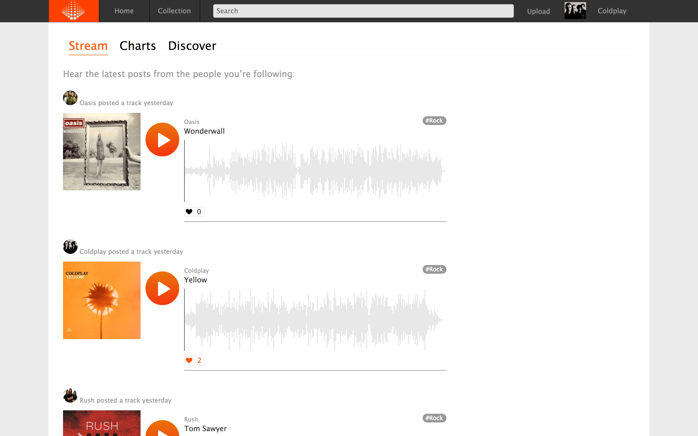

# Invoke

[Invoke][heroku]

[heroku]: http://www.invoke-.herokuapp.com

Invoke is a full stack web application inspired by soundcloud.  It utilizes Ruby on Rails on the backend, a PostgreSQL database, and React.js with a Redux architectural framework on the frontend.  


## Features & Implementation

### Continuous play and waveforms

Using a top level react component, Invoke allows you to listen to music whilst seamlessly navigating the site. I have used the react-waveform library in order to dynamically generate waveforms based on the song that is currently playing. The waveforms were a tricky feature to implement, given that they need to communicate effectively with the top level component in order for the positions to sync on both the waveform and the playbar. In order to allow for seamless play, I added two new fields to my audio reducer - a 'token' field, that would be responsible for determining whether the track was currently playing or paused, and a request field, which would be then used by my playbar component to provide the current playbar time to the other component.

The default state for my audio reducer:

```js
const defaultState = {
  track_url: "",
  user_id: null,
  id: null,
  token: "",
  request: ""
}
```

The action in my playbar that would provide the playback time:

```js
if (nextProps.audio.request === "REQUEST-TIME"){
  this.props.provideAudioPlaybackTime(this.music.currentTime)
}
```

Below is a gif of the continuous and responsive play in action:


### Bottom Playbar

This was perhaps one of the hardest logical challenges when building this website. My playbar dynamically sets the width of the progress component based upon the current playtime of the song in progress. Additionally, I have allowed the user to click on any position on the playbar, as well as to make it draggable, which will result in a change of the current time, and will update the corresponding waveform accordingly.

In order to get the playbar to resize as intended, I used the following code:

```js
let duration = this.music.duration;
let currentTime = this.music.currentTime;
this.fullduration.innerText = (this.timeshow(this.music.duration))

let newval = currentTime/duration;
let res = newval.toLocaleString("en", {minimumFractionDigits: 10, style: "percent"})
this.playbar.style.width = res;
this.timeelapased.innerText = `${this.timeshow(currentTime)}`
let ballval = newval * this.playbarholder.clientWidth
this.ball.style.left = (ballval) + 'px';
```


### Logged in homepage

The logged in homepage is a pseudo-index container which will show you all the songs posted by the users that you have followed. This page renders multiple waveforms, and is comprised on a number of 'SongplayContainers'. This page will allow you to dynamically choose songs and render waveforms. By clicking play on one song, another will stop. An image of it is below.




### User Show and Song Show pages

Each User and Song, when created, will be given their own show page. Song show pages will allow for comments on the song, as well as play, and User show pages will allow for play of all of their uploaded songs.

### Likes and Comments

Users can comment on songs, and like them also. My comment feature uses the current music playback time when commenting on the song in question in order to attribute a timestamp to the comment in question based on the song. If the song is not playing, users are assigned a random timestamp, as is the case on SoundCloud.

### CRUD

This app features both user and song CRUD.

## Future directions for the Project

### Search

I have currently implemented state search, but implementing full database search is the goal.

### Playlists and Reposts

These will be integral features if the app were ever to be used by the mass market

### Discover

I would like to make a discover and smart song feature based on the Echo Nest API

### Better Waveforms and storage in the song model

It would make sense to store the waveform data for each song in the relevant song model, so that the waveform data does not need to be generated every time the waveform is loaded up.
